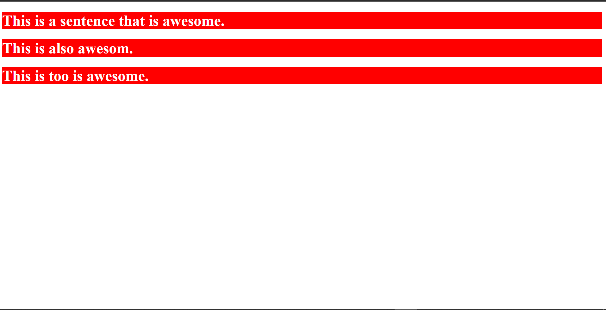
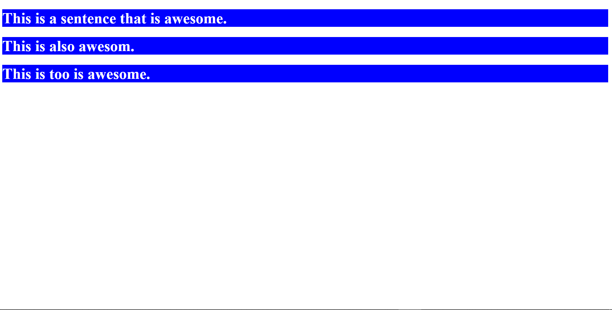
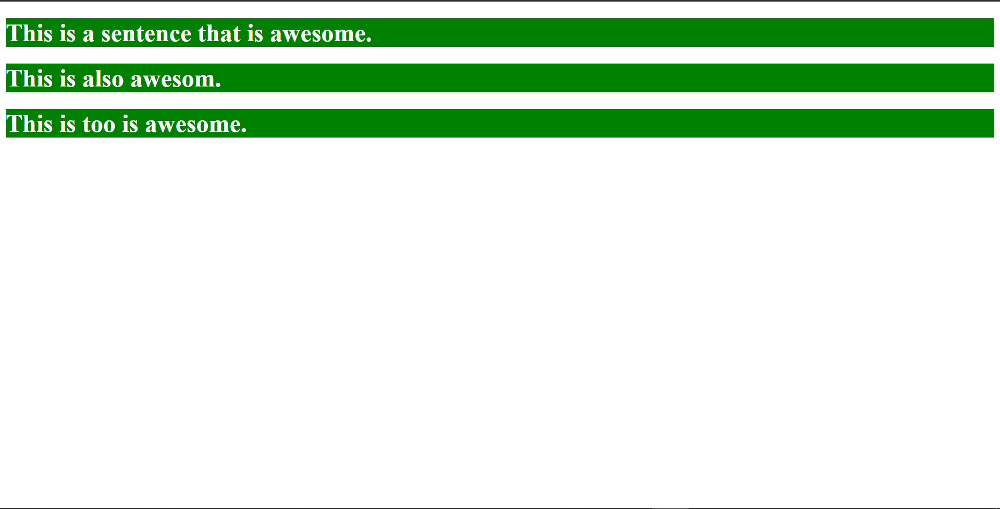
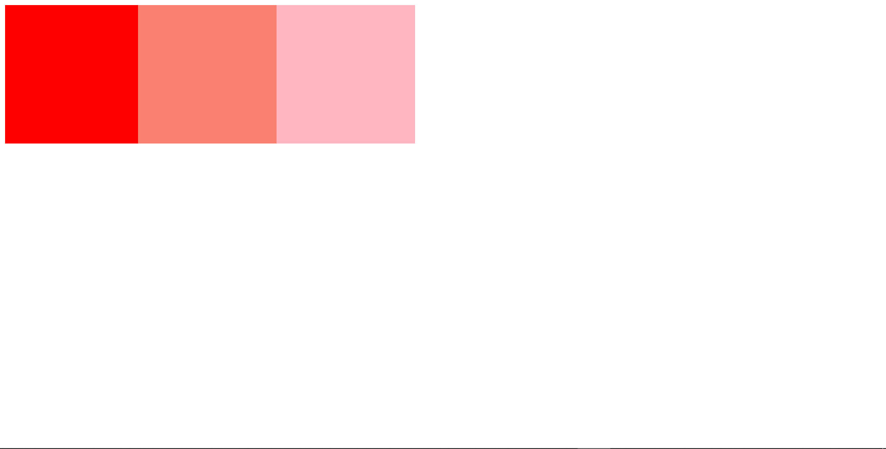
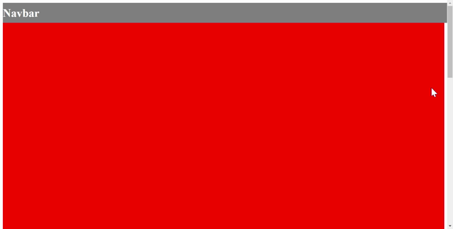
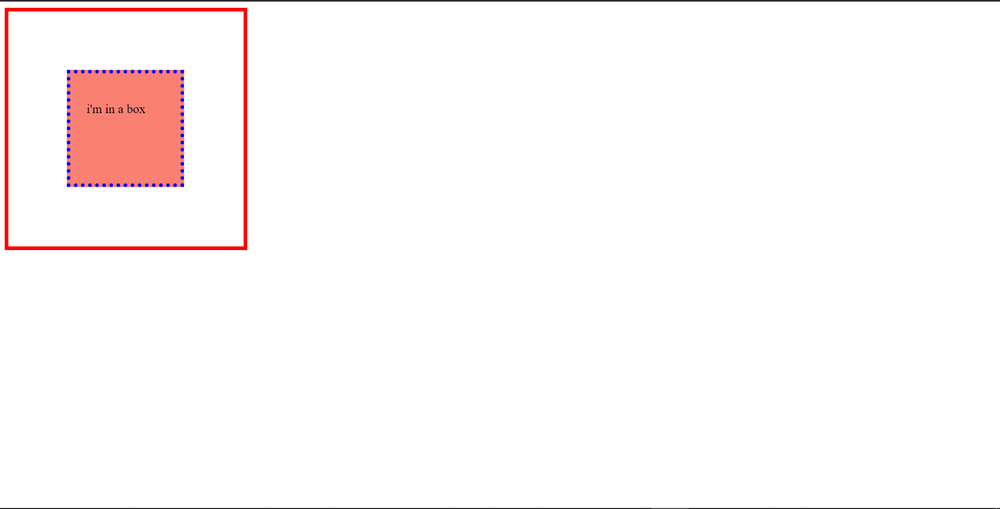
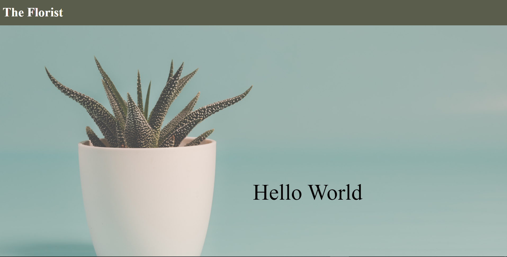

# HTML Reinforcement Revision 2

## Instructions

You are encouraged to read up and research if you are unsure of your answers. 

### Submission of answers

#### Submission via Google Forms

Please use code sandbox to submit your answers. Click on "share > copy sandbox link" and paste the link to the Google form provided.


#### Submission via GitHub

Open up the assignment page and click on the "Add or create" button then select "link".


When the prompt appears, paste in your GitHub repository URL that contains the solutions.


The GitHub repository URL is as shown.


Once you have loaded it successfully, click on the "Turn In" button.


<hr>

## Contents

[Question 1](#question-1-back-to-contents)<br>
[Question 1 Preview](#question-1-preview-back-to-contents)<br>
[Question 2](#question-2-back-to-contents)<br>
[Question 2 Preview](#question-2-preview-back-to-contents)<br>
[Question 3](#question-3-back-to-contents)<br>
[Question 3 Preview](#question-3-preview-back-to-contents)<br>
[Question 4](#question-4-back-to-contents)<br>
[Question 4 Preview](#question-4-preview-back-to-contents)<br>
[Question 5](#question-5-back-to-contents)<br>
[Question 5 Preview](#question-5-preview-back-to-contents)<br>
[Question 6](#question-6-back-to-contents)<br>
[Question 6 Preview](#question-6-preview-back-to-contents)<br>
[Question 7](#question-7-back-to-contents)<br>
[Question 7 Preview](#question-7-preview-back-to-contents)<br>
[Question 8](#question-8-back-to-contents)<br>
[Question 8 Preview](#question-8-preview-back-to-contents)<br>

<hr>

## Question 1 <a style="font-size:8pt;" href="#contents">[back to contents]</a>

Given this HTML code:

```html
<!DOCTYPE html>
<html>
  <head>
    <meta charset="utf-8">
    <meta name="viewport" content="width=device-width">
    <link href="style.css" type="text/css" rel="stylesheet">
    <title>Document</title>
  </head>
  <body>
      
      <h1>This is a sentence that is awesome.</h1>
      <h1>This is also awesom.</h1>
      <h1>This is too is awesome.</h1>
      
      <script src="script.js"></script>
  </body>
</html>
```

Write an **inline CSS** to be applied to `<h1></h1>` that would change its background color to red and its text color to white.

### Question 1 Preview <a style="font-size:8pt;" href="#contents">[back to contents]</a>



<hr>

## Question 2 <a style="font-size:8pt;" href="#contents">[back to contents]</a>

Given this HTML code:

```html
<!DOCTYPE html>
<html>
  <head>
    <meta charset="utf-8">
    <meta name="viewport" content="width=device-width">
    <link href="style.css" type="text/css" rel="stylesheet">
    <title>Document</title>
  </head>
  <body>
      
      <h1>This is a sentence that is awesome.</h1>
      <h1>This is also awesom.</h1>
      <h1>This is too is awesome.</h1>
      
      <script src="script.js"></script>
  </body>
</html>
```

Write an **internal CSS** to be applied to `<h1></h1>` that would change its background color to blue and its text color to white.

### Question 2 Preview <a style="font-size:8pt;" href="#contents">[back to contents]</a>



<hr>

## Question 3 <a style="font-size:8pt;" href="#contents">[back to contents]</a>

Given this HTML code:

```html
<!DOCTYPE html>
<html>
  <head>
    <meta charset="utf-8">
    <meta name="viewport" content="width=device-width">
    <link href="style.css" type="text/css" rel="stylesheet">
    <title>Document</title>
  </head>
  <body>
      
      <h1>This is a sentence that is awesome.</h1>
      <h1>This is also awesom.</h1>
      <h1>This is too is awesome.</h1>
      
      <script src="script.js"></script>
  </body>
</html>
```

Write an **external CSS** to be applied to `<h1></h1>` that would change its background color to green and its text color to white.

### Question 3 Preview <a style="font-size:8pt;" href="#contents">[back to contents]</a>



<hr>

## Question 4 <a style="font-size:8pt;" href="#contents">[back to contents]</a>

Using **position property** create three different colored boxes that would sit next to each other.

### Question 4 Preview <a style="font-size:8pt;" href="#contents">[back to contents]</a>



<hr>

## Question 5 <a style="font-size:8pt;" href="#contents">[back to contents]</a>

Using **position property** create a **single page webpage** that has three sections with a navbar that would follow along as you scroll.

### Question 5 Preview <a style="font-size:8pt;" href="#contents">[back to contents]</a>



<hr>

## Question 6 <a style="font-size:8pt;" href="#contents">[back to contents]</a>

Given the following code:

```html
<!DOCTYPE html>
<html lang="en">
  <head>
    <meta charset="UTF-8" />
    <meta name="viewport" content="width=device-width, initial-scale=1.0" />
    <meta http-equiv="X-UA-Compatible" content="ie=edge" />
    <link href="style.css" type="text/css" rel="stylesheet" />
    <title>Static Template</title>
  </head>
  <body>
    <div class="main">
      <div class="box">
         <p>i'm in a box</p>
      </div>
    </div>
  </body>
</html>

```

```css
.main {
  height: 300px;
  width: 300px;
  border: 5px red solid;
}

.box {
  height: 100px;
  width: 100px;
  background-color: salmon;
}
```

Using what you have learned in **padding, border and margin** add in codes such that:

1. the pink box is centered.
2. the pink box has a blue dotted border of 5px.
3. the text "i'm in a box" does not touch the edges of the box.

### Question 6 Preview <a style="font-size:8pt;" href="#contents">[back to contents]</a>



<hr>

## Question 7 <a style="font-size:8pt;" href="#contents">[back to contents]</a>

Create a simple colored box that would scale according to the size of the screen.

### Question 7 Preview <a style="font-size:8pt;" href="#contents">[back to contents]</a>


<hr>

## Question 8 <a style="font-size:8pt;" href="#contents">[back to contents]</a>

Create a **single page** website that has a navigation bar, a background image and text over it. 

The theme of the site is to your discretion. However, please refrain from creating socially inappropriate or mature contents.

### Question 8 Preview <a style="font-size:8pt;" href="#contents">[back to contents]</a>




